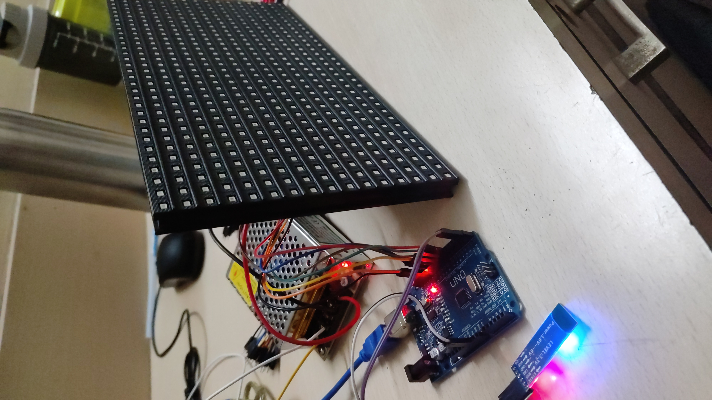

# Bluetooth-Controlled Wireless LED Notice Board 📢

An embedded hardware project designed to display wireless text notices on a P10 LED matrix display sent from an Android smartphone via Bluetooth.

---

## 📸 Overview & Demo

The system receives raw text strings sent over a Bluetooth terminal or dedicated Android application, parses the incoming serial buffer, and smoothly scrolls the notice across a P10 single-color LED matrix panel in real time.

| Hardware Setup | Demonstration Video |
| :---: | :---: |
|  | `VID_20230418_103258.mp4` |

---

## ⚙️ How It Works

1. **Wireless Reception:** An **HC-05 Bluetooth module** receives text data wirelessly from a paired Android app and streams it to the microcontroller via UART (`Rx`/`Tx`).
2. **Buffer Parsing:** The control firmware checks the incoming serial buffer, extracts the message string, and manages scrolling speed/display logic.
3. **Display Driving:** The parsed message is rendered into pixel configurations and scrolled continuously across the **P10 LED matrix panel**.
4. **Power Management:** Powered via a dedicated **5V 3A SMPS** power supply to safely handle the high current demands of the LED matrix.

---

## 🛠️ Hardware Stack & Components

* **Microcontroller:** ATmega328P / Arduino UNO
* **Communication Module:** HC-05 Bluetooth Module (UART Serial Interface)
* **Display Panel:** P10 Single-Color (Red) LED Matrix Display Panel (32x16 resolution)
* **Power Supply:** 5V 3A DC SMPS Adapter
* **Language:** C / C++ (Embedded AVR C / Arduino Framework)

---

## 📂 Repository Structure

Wireless-notice-board/
│
├── notice-board.c           # Main firmware code handling UART and display logic
├── README.md                # Project documentation
├── IMG-20230417-WA0023.jpeg # Hardware wiring and assembly image
└── VID_20230418_103258.mp4  # Video demonstration of the working notice board

---

## 🔌 Circuit Pin Connections

| HC-05 Module | Arduino UNO |
| :--- | :--- |
| `TX` | `RX` (Pin 0) |
| `RX` | `TX` (Pin 1) |
| `VCC` | `5V` |
| `GND` | `GND` |

> **Note:** Disconnect the `RX`/`TX` pins of the HC-05 module while uploading code to the Arduino via USB to prevent UART flashing conflicts.
